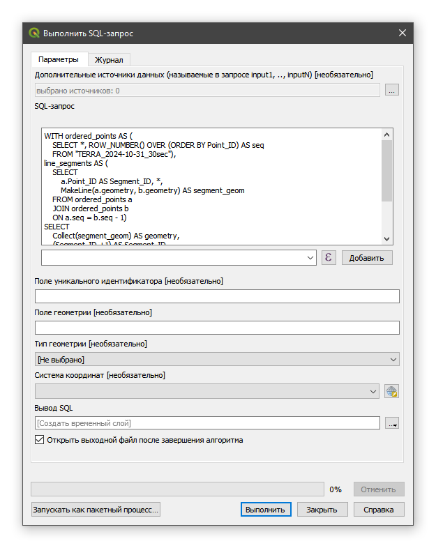
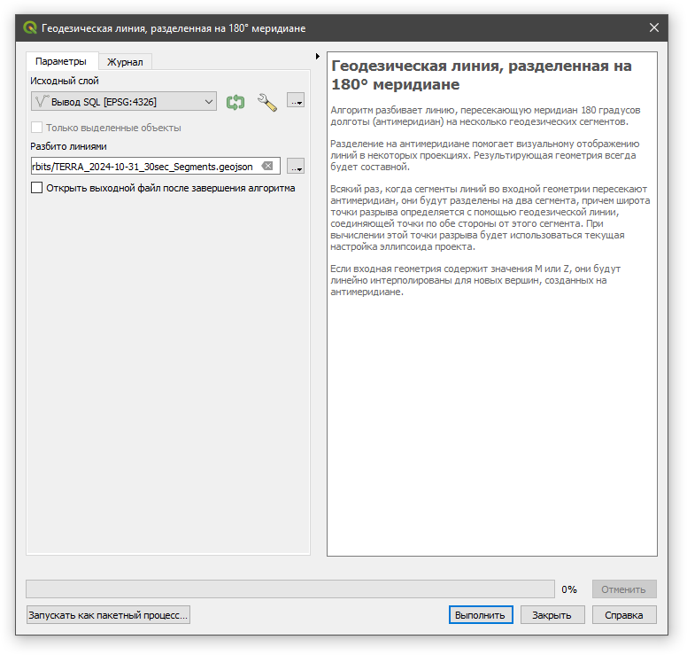

<!-- ВАЖНО: без "layout: default" локально не работает - сайт генерится, но без макета -->
<!-- А на GitHub, если есть любой пункт в заголовке, то сразу стр. 404. Нормально рендерится только когда вообще нет заголовка -->
<!-- Встречал еще какой-то tagline: Easy websites with GitHub Pages -->

<!-- 
    С проблемностью title/description при разворачивании на GitHub нашел пока такой выход:
    Если самая первая строка в README.md «простой текст», а не заголовок, то title/description берутся из _config.yml
 -->

Этот сайт можно открывать по короткой ссылке **<font color="#159957">bit.ly/RUDN-QGIS-ORBIT-L1</font>**. \
*Регистр букв должен быть сохранен, то есть заглавные буквы должны быть заглавными.*
<br><br>
<hr><hr> <!-- двойная разделительная линия ======================================================== -->
<br>


<!-- ISS Tracker Widget generator to your website! (https://isstracker.pl/en/info/cooperation) -->
<iframe width="600" height="300"
src="https://isstracker.pl/en/widget/map?
&disableInfoBox=1
&lang=en
&z=2
&mapType=satellite
&units=metric
&preloader=1
&showSatTooltip=1
&dayNightLayer=1
&showFutureOrbit=1"
style="max-width: 100%; border: 1px solid rgb(0, 163, 211); border-radius: 20px;">
</iframe>

<!-- ЗАГОТОВКА: подпись к виджету - МКС в реальном времени, линия - ее будущая трасса, тень - ночная сторона Земли -->


<!-- TOC -->

### ОГЛАВЛЕНИЕ

- [Введение](#введение)
- [Краткая теория](#краткая-теория)
	- [Зачем нужны наземные трассы КА](#зачем-нужны-наземные-трассы-ка)
	- [Двухстрочные элементы орбиты (TLE)](#двухстрочные-элементы-орбиты-tle)
	- [Почему трасса смещается к западу](#почему-трасса-смещается-к-западу)
- [Вариант задания](#вариант-задания)
- [Подготовка к работе](#подготовка-к-работе)
	- [Рабочая папка](#рабочая-папка)
	- [Установка Python и необходимых библиотек](#установка-python-и-необходимых-библиотек)
	- [Регистрация на Space-Track](#регистрация-на-space-track)
	- [Установка геоинформационной системы QGIS](#установка-геоинформационной-системы-qgis)
- [Расчет подспутниковых точек](#расчет-подспутниковых-точек)
- [Создание линейных слоев траекторий](#создание-линейных-слоев-траекторий)
- [Анимация пролета КА в QGIS](#анимация-пролета-ка-в-qgis)
- [Типичные ошибки и их решение](#типичные-ошибки-и-их-решение)
- [Обязательный самоконтроль результатов](#обязательный-самоконтроль-результатов)
- [Контрольные вопросы](#контрольные-вопросы)
<br>

<!-- /TOC -->

<br>
## Введение

<!-- ЗАГОТОВКА: что такое наземная (подспутниковая) трасса КА; что студент получит на выходе (4 GeoJSON-слоя и анимация пролета); связь с Частями 2 и 3 -->

В этой работе рассчитываются орбиты для двух космических аппаратов (КА):

1\. [**Международной космической станции**](https://ru.wikipedia.org/wiki/Международная_космическая_станция), сокр. МКС
(англ. International Space Station, сокр. ISS). \
Номер по спутниковому каталогу NORAD **25544**.

2\. [**TERRA**](https://ru.wikipedia.org/wiki/Терра_(спутник)) — транснационального научно-исследовательского спутника. \
Номер по спутниковому каталогу NORAD **25994**.

Орбиты рассчитываются только на одни сутки.

<!-- ЗАГОТОВКА: подпись к картинке-образцу результата -->


> #### *Обратите внимание:*
> <!-- ЗАГОТОВКА: время во всех данных и расчетах - UTC, а не московское (МСК = UTC + 3 ч) -->

<br>
🔼 [Вернуться к ОГЛАВЛЕНИЮ](#оглавление)

<br>
<hr><hr> <!-- двойная разделительная линия ======================================================== -->
<br>

## Краткая теория

### Зачем нужны наземные трассы КА

<!-- ЗАГОТОВКА: упрощенная цитата коллег из GIS-Lab (поиск данных ДЗЗ по времени пролета, например MODIS; планирование подспутниковых наблюдений) -->

### Двухстрочные элементы орбиты (TLE)

<!-- ЗАГОТОВКА: формат TLE с разбором полей, основные элементы орбиты; модель SGP4 и падение точности по мере удаления от эпохи TLE -->

### Почему трасса смещается к западу

<!-- ЗАГОТОВКА: вращение Земли и смещение витков к западу; ссылка https://en.wikipedia.org/wiki/Satellite_ground_track (на английском) -->

<br>
🔼 [Вернуться к ОГЛАВЛЕНИЮ](#оглавление)

<br>
<hr><hr> <!-- двойная разделительная линия ======================================================== -->
<br>

## Вариант задания

У каждого студента в этой работе свой вариант.

Варианты отличаются датой, для которой будет рассчитываться орбита КА.

Дату брать следующим образом: [день *– ваш номер по списку группы*] **сентября 2026**.

<!-- ЗАГОТОВКА: пример - студент с номером 27 рассчитывает орбиты на 27 сентября 2026 года (эта дата используется во всех примерах инструкции) -->

<br>
🔼 [Вернуться к ОГЛАВЛЕНИЮ](#оглавление)

<br>
<hr><hr> <!-- двойная разделительная линия ======================================================== -->
<br>

## Подготовка к работе

### Рабочая папка

<!-- ЗАГОТОВКА: рабочая папка (по образцу 3D-L1); врезка "Внимание" про имена файлов и папок только латиницей без пробелов; папка "Calculated_Tracks" для результатов -->

### Установка Python и необходимых библиотек

<!-- ЗАГОТОВКА (из черновика автора):
Для инструкции я бы рекомендовал Python 3.12 или 3.13.
Python 3.10 как раз в октябре 2026 года заканчивает свой жизненный цикл, поэтому ориентировать на него студентов не стоит.
Самые свежие версии (3.14) тоже лучше не брать в качестве рекомендованной, на них иногда запаздывают готовые сборки библиотек.
 -->


Файл «**TLE2GroundTracks_GeoJSON_2026-10-02.py**» прилагается (загружается по ссылке).

<!-- ЗАГОТОВКА: ссылки с атрибутом download на materials/TLE2GroundTracks_GeoJSON_2026-10-02.py и materials/requirements.txt -->

Для его работы необходимо установить следующие дополнительные библиотеки:

-   pyorbital
-   spacetrack

<!-- ЗАГОТОВКА: python -m pip install -r requirements.txt; при ошибке доступа - ключ --user; первая установка занимает несколько минут; проверка установки -->

### Регистрация на Space-Track

Пройдите регистрацию на сайте **space-track** и внесите необходимые учетные данные в код.

```python
# Имя пользователя и пароль (регистрация на https://www.space-track.org)
USERNAME = 'ваш_логин'
PASSWORD = 'ваш_пароль'
```

<!-- ЗАГОТОВКА (из черновика автора):
Стоит отдельно предупредить, что логин и пароль вписываются в свою копию скрипта и такой файл нельзя никуда выкладывать или пересылать.
Плюс упомянуть ограничения Space-Track на частоту запросов: если вся группа одновременно много раз подряд запускает скрипт с отладкой, аккаунты могут временно блокироваться.
 -->

### Установка геоинформационной системы QGIS

<!-- ЗАГОТОВКА: QGIS 3.16.16 (по образцу 3D-L1: ссылка на установщик, резервная ссылка, macOS, параметры установки) -->

<br>
🔼 [Вернуться к ОГЛАВЛЕНИЮ](#оглавление)

<br>
<hr><hr> <!-- двойная разделительная линия ======================================================== -->
<br>

## Расчет подспутниковых точек

Это мы выполним с помощью специального кода на Python.

Внизу Python-кода измените в четырех местах число «32» (день) (без нуля впереди) в соответствии с датой вашего варианта.

```python
# ISS (ZARYA) ( NORAD ID 25544 )
create_orbital_track_geojson_for_day(25544, date(2026, 9, 32), 0.5, r'ISS_2026-09-32_30sec.geojson')

# TERRA ( NORAD ID 25994 )
create_orbital_track_geojson_for_day(25994, date(2026, 9, 32), 0.5, r'TERRA_2026-09-32_30sec.geojson')
```

Иначе во время выполнения скрипта появится ошибка: `ValueError: day is out of range for month`.

<!-- ЗАГОТОВКА: что такое шаг 0.5 (мин) и какие значения допустимы; запрет ведущего нуля - SyntaxError -->

Сохраните внесенные в код изменения.

Запустите Python-код на исполнение.

<!-- ЗАГОТОВКА: как запустить - из командной строки и из IDE -->

При успешном выполнении создадутся два точечных GeoJSON-файла.


<!-- ЗАГОТОВКА: разбор вывода (эпоха TLE, предупреждение про 36 ч); ссылка на https://ru.wikipedia.org/wiki/GeoJSON; время UTC -->

Перенесите сгенерированные программой файлы в отдельную папку на вашем компьютере, задав ей имя «Calculated_Tracks».

<br>
🔼 [Вернуться к ОГЛАВЛЕНИЮ](#оглавление)

<br>
<hr><hr> <!-- двойная разделительная линия ======================================================== -->
<br>

## Создание линейных слоев траекторий

Создайте новый (пустой) QGIS-проект и добавьте в него созданные слои подспутниковых точек в формате GeoJSON.

Откройте в интерфейсе QGIS панель «Инструменты анализа».

Найдите алгоритм «**Выполнить SQL-запрос**» и откройте его панель.

Скопируйте представленный ниже код (SQL-запрос) и вставьте его в ячейку «**SQL-запрос**» панели алгоритма.

```sql
WITH ordered_points AS (
    SELECT
        *,
        ROW_NUMBER() OVER (ORDER BY Point_ID) AS seq
    FROM "<Имя слоя подспутниковых точек>"
),
line_segments AS (
    SELECT
        a.Point_ID AS Segment_ID,
        *,
        MakeLine(a.geometry, b.geometry) AS segment_geom
    FROM ordered_points a
    JOIN ordered_points b
        ON a.seq = b.seq - 1
)
SELECT
    Collect(segment_geom) AS geometry,
    (Segment_ID + 1) AS Segment_ID,
    Orbit_Num, Date_Time, Latitude, Longitude,
    Altitude, Velocity, Sun_Zenith, Orbit_Incl
FROM line_segments
GROUP BY Segment_ID
```

Измените текст `<Имя слоя подспутниковых точек>` на имя соответствующего слоя (в моем примере – это «TERRA_2026-09-27_30sec»).

Ячейку «Вывод SQL» оставьте незаполненной – таким образом создастся и добавится в QGIS временный слой.



Выполните алгоритм «Выполнить SQL-запрос», нажав кнопку «Выполнить».

Полученный новый линейный слой с именем «**Вывод SQL**» будет состоять из отдельных сегментов (отрезков) траектории, а каждому сегменту присвоятся соответствующие точке его начала атрибутивные данные.

<!-- ЗАГОТОВКА: в слое "Вывод SQL" поле Date_Time строковое (String) - это нормально, в итоговом GeoJSON оно станет "дата и время" -->

Однако полученный слой будет «иметь проблемы» на антимеридиане.

<!-- ЗАГОТОВКА: объяснение проблемы горизонтальных линий (отрезки через всю карту на ±180°) - зачем нужен следующий алгоритм -->


Устранить данное явление можно с помощью алгоритма «**Геодезическая линия, разделенная на 180° меридиане**».

Найдите его в панели «Инструменты анализа» и откройте его панель.



Укажите путь для сохранения файла, задав ему формат GeoJSON и имя соответствующей орбиты, добавив к нему в конце «_Segments»
(в моем примере – это «TERRA_2026-09-27_30sec_Segments.geojson»).

<!-- ЗАГОТОВКА: повторить SQL-запрос и разделение для второго КА (МКС) -->

**В результате у вас должно получиться (создаться) четыре следующих файла:**


(в моем примере орбиты рассчитаны для 27 сентября 2026 года).

> #### *Справочно:*
> <!-- ЗАГОТОВКА: алгоритм "Точки в контур" (Points to path) - альтернатива: строит линию (можно с группировкой по атрибуту), но с горизонтальными линиями на антимеридиане и без атрибутов по отрезкам -->

<br>
🔼 [Вернуться к ОГЛАВЛЕНИЮ](#оглавление)

<br>
<hr><hr> <!-- двойная разделительная линия ======================================================== -->
<br>

## Анимация пролета КА в QGIS

<!-- ЗАГОТОВКА: проект в EPSG:3857, фон OpenStreetMap; свойства точечного слоя - вкладка "Хронология" (поле Date_Time); панель управления временем; время UTC; стили - по желанию -->


<br>
🔼 [Вернуться к ОГЛАВЛЕНИЮ](#оглавление)

<br>
<hr><hr> <!-- двойная разделительная линия ======================================================== -->
<br>

## Типичные ошибки и их решение

<!-- ЗАГОТОВКА: ValueError (день 32); SyntaxError (ведущий ноль); "python не является внутренней или внешней командой" (PATH); ошибка доступа pip (--user); неверный логин Space-Track; "Невозможно извлечь TLE"; файл не найден / сохранен не там; горизонтальные линии через всю карту -->

<br>
🔼 [Вернуться к ОГЛАВЛЕНИЮ](#оглавление)

<br>
<hr><hr> <!-- двойная разделительная линия ======================================================== -->
<br>

## Обязательный самоконтроль результатов

<!-- ЗАГОТОВКА: проверка 4 файлов, их таблиц атрибутов и типа поля Date_Time; работающая анимация; от результатов зависит выполнение Частей 2 и 3; результат должен быть предоставлен (продемонстрирован) преподавателю по первому требованию -->

<br>
🔼 [Вернуться к ОГЛАВЛЕНИЮ](#оглавление)

<br>
<hr><hr> <!-- двойная разделительная линия ======================================================== -->
<br>

## Контрольные вопросы

<!-- ЗАГОТОВКА -->

<br>
<hr><hr> <!-- двойная разделительная линия ======================================================== -->
<br>

🔼 [Вернуться к ОГЛАВЛЕНИЮ](#оглавление)
